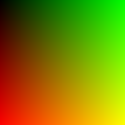

### Simple raytracer
Based on the raytracing in a weekend [article](https://raytracing.github.io/books/RayTracingInOneWeekend.html).

### Purpose of the repository
* I was interested in graphical programming, and though it would be a small and relatively simple introductory project.
* I also wanted to improve my knowledge of C++ - i tried to use some of the newer C++ features.

### Build the project
* You can open the project in Visual Studio, then build and run with `ctrl+f5`
* You can also build it with cmake:
```
cmake -B build
make -C build all
./build/raytracer
```

### Dependencies
This project uses glm for vector operations. The code for glm is directly in the repository (thirdparty directory).

### The future
Stuff i may want to add in the future:
* multithreading
* light sources
* textures
* objects different than spheres

### The final render

