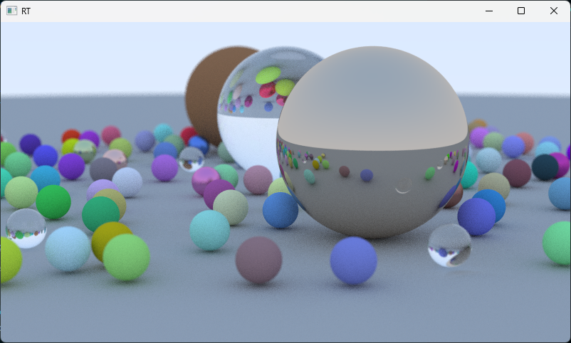

### Simple CUDA raytracer
Based on the [raytracing in one weekend](https://raytracing.github.io/books/RayTracingInOneWeekend.html) and [this nvidia blogpost](https://developer.nvidia.com/blog/accelerated-ray-tracing-cuda/). The program draws a simple scene to a OpenGL window.

### Build the project
* Open the project in Visual Studio, then build and run with `ctrl+f5`
* Build using CMake (in release or debug mode):
```
cmake -S . -B out -G "NMake Makefiles" -DCMAKE_BUILD_TYPE=Release
cmake --build out --config Release
./out/raytracer
```

```
cmake -S . -B out -G "NMake Makefiles" -DCMAKE_BUILD_TYPE=Debug
cmake --build out --config Debug
./out/raytracer
```

### Dependencies
* glm
* cuda toolkit
* OpenGL - glfw, glad

### TODO
* multithreading - done
* Render to window instead of a bitmap file - done
* CUDA - done
* OpenGL window instead of WinAPI - done
* BHV acceleration
* polygon meshes 
* other optimizations 
* light sources
* textures 
* optix

### The final render



